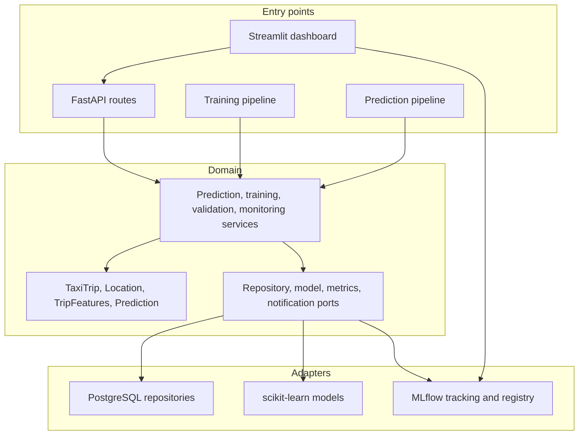

# Architecture

The code uses ports and adapters so deterministic trip rules remain independent of FastAPI, PostgreSQL, and MLflow.

## Runtime boundaries

- Domain tests require only NumPy and do not contact a network service.
- PostgreSQL is optional until a database-backed adapter is constructed; `DATABASE_URL` has no credential-bearing fallback.
- The local MLflow default writes to `data/mlflow.db`; the directory and artifacts are runtime output and are ignored.
- Compose supplies PostgreSQL and MLflow as separate services. API and dashboard images run as non-root users.

## Provenance boundaries

No source dataset or fitted production model is part of the tracked repository. Bootstrap runs use generated regression data and tag the run as synthetic. Any real-data demonstration must document dataset source, license, filtering, train/test split, feature definition, and model evaluation separately.

## Known gaps

The unit suite does not prove full-stack availability, database-schema portability, model quality, dashboard behavior, or cloud deployment. The live-service validation scripts are retained as manual probes and should not be confused with assertion-based tests.
