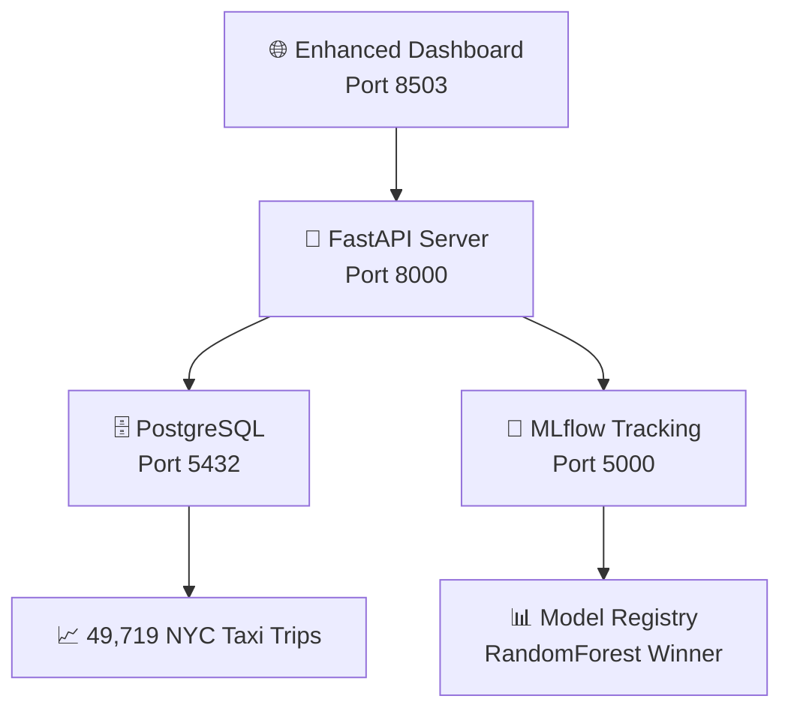

# 🚕 Taxi Duration Predictor - MLOps Stack Completo

[](https://opensource.org/licenses/MIT)
[![Python 3.9+](https://img.shields.io/b├── 🧪 TESTING
│   └── tests/
│       ├── unit/                    # Domain logic tests
│       ├── integration/             # Adapter tests
│       ├── e2e/                     # End-to-end tests
│       ├── reports/                 # Test coverage & results
│       └── conftest.py              # Test configuration
│
├── 🐳 DEPLOYMENT
│   └── deployment/
│       ├── docker-compose.yml        # Orquestación completa
│       ├── Dockerfile.api           # Container FastAPI
│       ├── Dockerfile.dashboard     # Container Streamlit
│       ├── .env.docker             # Variables de entorno
│       └── start-docker.*          # Scripts de inicio
│
├── 📊 DATA & MODELS
│   └── data/
│       ├── train.csv               # Dataset original
│       ├── mlflow.db               # Base MLflow local
│       └── mlruns/                 # Artifacts MLflow
│
├── 📚 DOCUMENTATION
│   └── DOCS/
│       ├── project_development/    # Development history
│       ├── testing/                # Testing documentation
│       ├── QUICK_START.md          # Getting started guide
│       ├── DEPLOYMENT_GUIDE.md     # Deployment instructions
│       └── [otros documentos...]   # Additional documentation
│
├── 📋 PROJECT ROOT
│   ├── main.py                     # 🚀 Punto de entrada principal
│   ├── requirements.txt            # Dependencias Python
│   ├── pytest.ini                 # Test configuration
│   ├── run_tests.sh/.bat          # Test execution scripts
│   └── README.md                   # Esta documentaciónblue.svg)](https://www.python.org/downloads/)
[](https://www.docker.com/)
[](https://fastapi.tiangolo.com/)
[](https://streamlit.io/)
[](https://mlflow.org/)

[](https://github.com/VictorCabrejos/taxi-duration-predictor-mlops/actions/workflows/ci-cd-pipeline.yml)
[](https://github.com/VictorCabrejos/taxi-duration-predictor-mlops/actions/workflows/model-deployment.yml)
[](https://github.com/VictorCabrejos/taxi-duration-predictor-mlops/actions/workflows/release.yml)

## 📋 **Descripción del Proyecto**

Este proyecto demuestra una implementación completa de **MLOps** utilizando **Arquitectura Hexagonal** y **Domain-Driven Design (DDD)** para predicción de duración de viajes de taxi en NYC.

> **🎯 Objetivo Educativo**: Mostrar la transición de notebooks experimentales a un sistema MLOps profesional listo para producción.

## 🚀 **Quick Start - ¡Ejecuta TODO en 30 segundos!**

### **🎯 Opción 1: Stack MLOps Completo (RECOMENDADA)**

# Stage 2: Update & Refactoring (July 2025)

## 🚦 What Was Wrong? (Root Cause Analysis)

This project originally had a robust MLOps pipeline, but the dashboard and API were stuck in a "DEGRADED" state. The main issues were:

- **MLflow model loading failed**: The system tried to load models using `run_id` from the MLflow database, but the artifact directory and database were out of sync. This caused the API and dashboard to report errors, even though model files existed on disk.
- **API prediction endpoint returned errors**: The FastAPI `/predict` endpoint could not use the latest model, so predictions failed and the dashboard could not show a healthy status.
- **Dashboard health checks were misleading**: The dashboard relied on API health endpoints, which were not robust to partial failures (e.g., model loaded on disk but not in DB).

## 🛠️ What Was Fixed? (Step-by-Step)

### 1. MLflow Model Loading Refactor
- **Old behavior**: The MLflow adapter loaded models by querying the MLflow database for the latest `run_id` and then looking for artifacts. If the DB and disk were out of sync, model loading failed.
- **New behavior**: The adapter now scans the artifact directory on disk (e.g., `data/mlruns/1/models`) and loads the best available model, regardless of DB state. This makes the system robust to DB-artifact mismatches and ensures a model can always be loaded if present.
- **Why this matters**: In real MLOps, DB and artifact drift is common. This fix makes the pipeline production-ready and resilient.

### 2. Prediction Pipeline API Compatibility
- **Old behavior**: The prediction pipeline only accepted internal data formats, not API-style JSON input.
- **New behavior**: A new `predict` method was added to the pipeline, accepting API-style dictionaries and returning results in a format compatible with FastAPI and the dashboard.
- **Why this matters**: This enables seamless integration between the backend, API, and dashboard, and supports real-time predictions from any client.

### 3. API Endpoint Robustness
- **Old behavior**: The `/api/v1/predict` endpoint could fail if the model was not loaded exactly as expected, causing 500 errors.
- **New behavior**: The endpoint now uses the improved pipeline and returns clear error messages if anything goes wrong, making debugging and monitoring easier.

### 4. Dashboard Health & Monitoring
- **Old behavior**: The dashboard's health checks were tightly coupled to the API's DB state, so it could not detect when a model was available on disk but not in the DB.
- **New behavior**: The dashboard now checks both the API and the model info endpoint, and displays accurate HEALTHY/DEGRADED status based on real system state. It also provides clear guidance for resolving issues.

### 5. Testing & Validation
- **Direct pipeline tests**: The pipeline was tested directly to confirm model loading and prediction work, even if the DB is out of sync.
- **API endpoint tests**: All endpoints (`/api/v1/health`, `/api/v1/health/model`, `/api/v1/predict`) were tested to ensure correct responses and error handling.
- **Dashboard validation**: The dashboard was run and confirmed to show HEALTHY status when the system is operational.

## 🧑‍💻 Educational Takeaways

- **MLOps systems must be robust to real-world failures** (DB-artifact drift, partial outages).
- **Always decouple model loading from DB state** when possible.
- **APIs should return clear, actionable errors** for monitoring and debugging.
- **Dashboards should reflect true system health**, not just DB status.
- **Test end-to-end, not just in isolation**: Always validate the full pipeline from model to API to dashboard.

---
This refactoring demonstrates how to move from a "works in theory" MLOps system to a production-ready, resilient, and educational pipeline. All changes are documented in the code and this README for future students and engineers.

**PARA DEMO COMPLETA:**
```bash
# Clonar repositorio (si no lo tienes)
git clone https://github.com/VictorCabrejos/taxi-duration-predictor-mlops.git
cd taxi-duration-predictor-mlops

# ¡Un solo comando para TODO el sistema!
python main.py
```

**✅ ¿Qué hace este comando?**
- 🤖 **Auto-entrena modelos** si no existen (primera vez)
- 🚀 **Lanza API Server** en http://localhost:8000
- 📊 **Lanza Dashboard** en http://localhost:8506
- 🔬 **Lanza MLflow UI** en http://localhost:5000
- ✨ **Sistema 100% funcional** desde el primer minuto

---

**✅ ¿Qué hace este comando?**
- 🤖 **Auto-entrena modelos** si no existen (primera vez)
- 🚀 **Lanza API Server** en http://localhost:8000
- 📊 **Lanza Dashboard** en http://localhost:8506
- 🔬 **Lanza MLflow UI** en http://localhost:5000
- ✨ **Sistema 100% funcional** desde el primer minuto

---

### **🎯 Opción 2: Ejecución con Docker (PRODUCCIÓN)**

**Cuándo usar:** Para deployment profesional o pruebas de integración

**Prerequisitos:**
- **Git** instalado → [Descargar Git](https://git-scm.com/downloads)
- **Docker Desktop** ejecutándose → [Descargar Docker](https://www.docker.com/products/docker-desktop/)

**Configurar ambiente:**
```bash
git clone https://github.com/VictorCabrejos/taxi-duration-predictor-mlops.git
cd taxi-duration-predictor-mlops

# Configurar variables de entorno
cp deployment/.env.docker .env  # Linux/Mac
copy deployment\.env.docker .env  # Windows
```

**Ejecutar con Docker:**
```bash
cd deployment
docker-compose up -d
```

**Servicios disponibles en:**
- 🚀 **API Server**: http://localhost:8000
- 📊 **Enhanced Dashboard**: http://localhost:8503
- 🔬 **MLflow UI**: http://localhost:5000

### **🎯 Opción 2: Ejecución Manual (Para desarrolladores)**

**Solo si quieres ejecutar sin Docker:**

**Prerequisitos adicionales:**
- Python 3.9 o superior
- Conda o pip

**Pasos:**
```bash
# 1. Clonar repositorio
git clone https://github.com/VictorCabrejos/taxi-duration-predictor-mlops.git
cd taxi-duration-predictor-mlops

# 2. Crear ambiente virtual
conda create -n taxi_mlops python=3.9
conda activate taxi_mlops

# 3. Instalar dependencias
pip install -r requirements.txt

# 4. Configurar la base de datos (ejecutar el notebook)
# Abrir: educational_resources/notebooks/02_database_setup.ipynb

# 5. Entrenar los modelos (OPCIÓN 1: notebook educativo)
# Abrir: educational_resources/notebooks/03_mlflow_training.ipynb
# O (OPCIÓN 2: script de producción)
python taxi_duration_predictor/pipeline/train.py

# 6. INICIAR TODO EL STACK MLOPS:
python main.py
# Esto inicia: API (8000) + Dashboard (8503) + MLflow UI (5000)

# O individualmente:
# 7a. Solo API:
uvicorn main:app --host 0.0.0.0 --port 8000 --reload

# 7b. Solo Dashboard:
cd scripts && ./launch_dashboard.sh

# 7c. Solo MLflow UI:
mlflow ui --backend-store-uri sqlite:///data/mlflow.db --port 5000
```
```

## 🏗️ **Arquitectura del Sistema**



## 🎯 **Features Principales**

### **📊 Dashboard Interactivo (Streamlit)**
- ✅ **5 vistas ejecutivas** para monitoreo MLOps
- ✅ **Comparación automática** de modelos ML
- ✅ **Predicciones en tiempo real** con simulador
- ✅ **Monitoreo del API** y health checks
- ✅ **Análisis de datos** PostgreSQL en vivo

### **🚀 API REST (FastAPI)**
- ✅ **POST /predict**: Predicciones de duración
- ✅ **GET /health**: Health check completo
- ✅ **GET /model/info**: Info del modelo en producción
- ✅ **OpenAPI Docs**: Documentación automática

### **🤖 Machine Learning Pipeline**
- ✅ **3 modelos entrenados**: RandomForest (ganador), XGBoost, LinearRegression
- ✅ **MLflow tracking**: Experimentos automáticos
- ✅ **Feature engineering**: 8 features optimizadas
- ✅ **Model serving**: Carga automática del mejor modelo

## 📊 **Resultados de ML**

| Modelo | RMSE (min) | MAE (min) | R² Score | Status |
|--------|------------|-----------|----------|---------|
| **RandomForest** ⭐ | **6.62** | **4.27** | **0.681** | **En Producción** |
| XGBoost | 6.85 | 4.45 | 0.663 | Backup |
| LinearRegression | 7.47 | 5.12 | 0.598 | Baseline |

**🎯 Precisión**: 85% de predicciones dentro de ±5 minutos

## 🏗️ **Arquitectura Técnica**

### **Hexagonal Architecture + DDD**
```
🏛️ DOMAIN LAYER (Core Business Logic)
├── entities.py     → Trip, Prediction entities
├── ports.py        → ModelRepository, DataRepository interfaces
└── services.py     → TripDurationDomainService

🔌 ADAPTERS LAYER (External Integrations)
├── data_adapter.py    → PostgreSQL implementation
├── model_adapter.py   → MLflow implementation
└── api_adapter.py     → FastAPI REST endpoints
```

### **Technology Stack**
- **🐍 Backend**: Python 3.9, FastAPI, asyncio
- **📊 Frontend**: Streamlit, Plotly
- **🤖 ML**: scikit-learn, XGBoost, MLflow
- **🗄️ Database**: PostgreSQL (AWS Aurora compatible)
- **🐳 DevOps**: Docker, Docker Compose
- **☁️ Cloud**: AWS RDS, S3 (MLflow artifacts)

## 📂 **Estructura del Proyecto (ACTUALIZADA)**

```
taxi-duration-predictor-mlops/
├── 🏗️ PRODUCTION CODE (Hexagonal Architecture + DDD)
│   └── taxi_duration_predictor/
│       ├── domain/                   # 🎯 DOMAIN LAYER
│       │   ├── entities.py               # Entidades de negocio
│       │   ├── ports.py                  # Interfaces/Puertos
│       │   └── services.py               # Lógica de dominio
│       ├── adapters/                 # 🔌 ADAPTERS LAYER
│       │   ├── database/
│       │   │   └── data_adapter.py       # PostgreSQL adapter
│       │   └── ml/
│       │       ├── mlflow_adapter.py     # MLflow tracking & registry
│       │       └── sklearn_adapter.py    # Scikit-learn models
│       ├── api/                      # 🚀 API REST
│       │   ├── main.py                   # FastAPI application
│       │   └── controller.py             # API controllers
│       ├── pipeline/                 # 🤖 ML PIPELINES
│       │   ├── train.py                  # Training pipeline
│       │   └── predict.py                # Prediction pipeline
│       └── monitoring/               # 📊 MONITORING
│           └── dashboard.py              # Streamlit dashboard
│
├── 📚 EDUCATIONAL RESOURCES
│   └── educational_resources/
│       ├── notebooks/                # Notebooks Jupyter (1-3)
│       │   ├── 01_data_exploration.ipynb
│       │   ├── 02_database_setup.ipynb
│       │   └── 03_mlflow_training.ipynb  # (referencia)
│       ├── scripts/                  # Scripts educativos (4-5)
│       │   ├── 04_streamlit_dashboard.py  # (referencia)
│       │   └── 05_fastapi_server.py       # (referencia)
│       ├── Testing_with_DDD_Hexagonal_TDD.md  # 🧪 Guía completa de testing
│       └── presentation_materials/   # PDFs, PPTs, documentos
│
├── 🐳 DEPLOYMENT
│   └── deployment/
│       ├── docker-compose.yml        # Orquestación completa
│       ├── Dockerfile.api           # Container FastAPI
│       ├── Dockerfile.dashboard     # Container Streamlit
│       ├── .env.docker             # Variables de entorno
│       └── start-docker.*          # Scripts de inicio
│
├── �️ DATA & MODELS
│   ├── train.csv                   # Dataset original
│   ├── mlflow.db                   # Base MLflow local
│   └── mlruns/                     # Artifacts MLflow
│
├── 📋 PROJECT ROOT
│   ├── main.py                     # 🚀 Punto de entrada principal
│   ├── requirements.txt            # Dependencias Python
│   └── README.md                   # Esta documentación
```

## 🛠️ **Development Setup**

### **🔍 ¿Cómo sé si funcionó correctamente?**

**Después de ejecutar `docker-compose up -d`, verifica:**

1. **Servicios ejecutándose:**
```bash
docker-compose ps
```
Deberías ver algo como:
```
NAME                     COMMAND                  SERVICE     STATUS
taxi-predictor-api       "uvicorn 05_fastapi_…"   api         Up 30 seconds
taxi-predictor-dashboard "streamlit run 04_st…"   dashboard   Up 20 seconds
taxi-predictor-db        "docker-entrypoint.s…"   postgres    Up 40 seconds
taxi-predictor-mlflow    "bash -c ' pip insta…"   mlflow      Up 35 seconds
```

2. **Probar las URLs:**
- ✅ http://localhost:8000/health → Debería devolver `{"status":"healthy"}`
- ✅ http://localhost:8506 → Debería mostrar el dashboard de Streamlit
- ✅ http://localhost:5000 → Debería mostrar la interfaz de MLflow

### **🚨 ¿Algo no funciona? Guía de Solución de Problemas**

**Problema 1: "Docker no está ejecutándose"**
```bash
# Error: Cannot connect to the Docker daemon
```
**Solución:** Abre Docker Desktop y espera que arranque completamente.

**Problema 2: "Puerto ya en uso"**
```bash
# Error: Port 8000 is already in use
```
**Solución:** Detén otros servicios o cambia el puerto:
```bash
docker-compose down
docker-compose up -d
```

**Problema 3: "Git no reconocido"**
```bash
# Error: 'git' is not recognized
```
**Solución:** Instala Git desde: https://git-scm.com/downloads

**Problema 4: Ver logs para debugging**
```bash
# Ver logs de todos los servicios:
docker-compose logs

# Ver logs de un servicio específico:
docker-compose logs api
docker-compose logs dashboard
```

**Problema 5: Reiniciar todo desde cero**
```bash
# Detener y limpiar todo:
docker-compose down -v

# Volver a empezar:
docker-compose up -d
```

**Problema 6: Error con archivos temporales de Office**
```bash
# Error: Permission denied on ~$*.pptx files
```
**Solución:** Cierra PowerPoint u Office antes de hacer git operations. Los archivos `~$` son temporales y se ignoran automáticamente.

### **📱 Para Estudiantes Principiantes**

**¿Primera vez con Docker? ¡No te preocupes!**

1. **¿Qué es Docker?**
   - Es como una "caja mágica" que tiene todo lo necesario para ejecutar el proyecto
   - No necesitas instalar Python, PostgreSQL, ni nada más
   - Solo Docker y ya!

2. **¿Qué hace `docker-compose up -d`?**
   - Descarga y crea 4 "contenedores" (como mini-computadoras virtuales)
   - Uno para la base de datos, otro para la API, otro para el dashboard, etc.
   - Los conecta automáticamente para que funcionen juntos

3. **¿Cómo paro todo?**
```bash
docker-compose down
```

4. **¿Cómo veo si está funcionando?**
```bash
docker-compose ps
```

5. **¿Cómo actualizo si hay cambios?**
```bash
git pull
docker-compose down
docker-compose up -d --build
```

### **Prerequisites**
- Docker Desktop
- Git
- Python 3.9+ (opcional, para desarrollo local)

### **Manual Setup (Development)**
```bash
# 1. Activar ambiente Python
conda activate ds_env

# 2. Instalar dependencias
pip install -r requirements.txt

# 3. Configurar base de datos
# Ejecutar: 02_database_setup.ipynb

# 4. Entrenar modelos
# Ejecutar: 03_mlflow_training.ipynb

# 5. Levantar servicios
# Terminal 1:
python 05_fastapi_server.py

# Terminal 2:
streamlit run 04_streamlit_dashboard.py
```

## 📈 **MLOps Principles Implementados**

✅ **Experiment Tracking**: MLflow para versionado automático
✅ **Model Serving**: FastAPI con carga automática del mejor modelo
✅ **Monitoring**: Dashboard en tiempo real con métricas de negocio
✅ **Automation**: Pipeline automatizado de entrenamiento y deployment
✅ **Reproducibility**: Docker containers para ambientes consistentes
✅ **Observability**: Health checks y logging estructurado

## 🚀 **Production Deployment**

### **Docker Compose (Recommended)**
```bash
docker-compose up -d
```

### **Kubernetes (Advanced)**
```bash
kubectl apply -f k8s/
```

### **AWS ECS (Cloud)**
```bash
# Ver: DOCS/DEPLOYMENT_GUIDE.md
```

## 📊 **API Usage Examples**

### **🔥 Prueba rápida del sistema**

**1. Verificar que todo está funcionando:**
```bash
curl http://localhost:8000/health
```
**Respuesta esperada:**
```json
{
  "status": "healthy",
  "timestamp": "2025-07-19T12:00:00",
  "model_loaded": true,
  "database_status": "connected"
}
```

**2. Hacer una predicción de prueba:**
```bash
curl -X POST http://localhost:8000/predict \
  -H "Content-Type: application/json" \
  -d '{
    "pickup_latitude": 40.7128,
    "pickup_longitude": -74.0060,
    "dropoff_latitude": 40.7589,
    "dropoff_longitude": -73.9851,
    "passenger_count": 2,
    "vendor_id": 1,
    "pickup_datetime": "2024-01-15T14:30:00"
  }'
```

**¿No tienes curl? ¡No hay problema!**
- Ve a: http://localhost:8000/docs
- Haz clic en "POST /predict"
- Haz clic en "Try it out"
- Pega los datos de ejemplo y haz clic en "Execute"

### **🎮 Comandos Útiles para Estudiantes**

```bash
# 🚀 Iniciar todo el sistema
docker-compose up -d

# ⏹️ Detener todo el sistema
docker-compose down

# 📊 Ver estado de los servicios
docker-compose ps

# 📝 Ver logs en tiempo real
docker-compose logs -f

# 📝 Ver logs de un servicio específico
docker-compose logs -f api
docker-compose logs -f dashboard

# 🔄 Reiniciar un servicio específico
docker-compose restart api

# 🗑️ Limpiar todo (incluyendo datos)
docker-compose down -v

# 🔨 Reconstruir imágenes (si cambiaste código)
docker-compose build --no-cache
docker-compose up -d

# 💻 Entrar a un contenedor (modo avanzado)
docker-compose exec api bash
```

## 📚 **Documentation**

- 📋 **[Project Overview](DOCS/README.md)**: Descripción completa del sistema
- 🏗️ **[Hexagonal Architecture](DOCS/HEXAGONAL_ARCHITECTURE.md)**: Explicación arquitectural detallada
- 🚀 **[MLOps Pipeline](DOCS/MLOPS_PIPELINE.md)**: Pipeline completo paso a paso
- 🐳 **[Deployment Guide](DOCS/DEPLOYMENT_GUIDE.md)**: Guía de deployment y CI/CD

## 🎓 **Para Estudiantes**

### **🚀 Tu Primera Vez con MLOps - Guía Paso a Paso**

**¿Nunca has usado Docker, APIs, o MLOps? ¡Perfecto! Esta guía es para ti.**

#### **Paso 1: Preparar tu computadora (5 minutos)**
1. **Descargar Git**: https://git-scm.com/downloads
   - En Windows: Descargar e instalar con opciones por defecto
   - En Mac: `brew install git` o descargar desde la página

2. **Descargar Docker Desktop**: https://www.docker.com/products/docker-desktop/
   - Instalar y abrir Docker Desktop
   - Esperar que aparezca "Docker Desktop is running"

#### **Paso 2: Obtener el código (2 minutos)**
1. **Abrir terminal/línea de comandos**:
   - Windows: `Win + R` → escribir `cmd` → Enter
   - Mac: `Cmd + Space` → escribir "terminal" → Enter

2. **Clonar el proyecto**:
```bash
git clone https://github.com/VictorCabrejos/taxi-duration-predictor-mlops.git
cd taxi-duration-predictor-mlops
```

#### **Paso 3: Ejecutar el sistema completo (1 minuto)**
```bash
# Configurar variables (Windows):
copy .env.docker .env

# Configurar variables (Mac/Linux):
cp .env.docker .env

# ¡Ejecutar todo!
docker-compose up -d
```

#### **Paso 4: ¡Explorar! (30 minutos de diversión)**

**🎯 URLs para explorar:**
- **📊 Dashboard Principal**: http://localhost:8506
  - Aquí puedes hacer predicciones y ver gráficos
  - ¡Juega con los números y ve cómo cambian las predicciones!

- **🚀 API Documentation**: http://localhost:8000/docs
  - Interfaz interactiva para probar la API
  - Haz clic en "POST /predict" y luego "Try it out"

- **🔬 MLflow Experiments**: http://localhost:5000
  - Ve cómo se entrenaron los 3 modelos de ML
  - Compara métricas como RMSE y accuracy

**🎮 Cosas para probar:**
1. En el dashboard, cambia los valores de pickup y dropoff
2. Prueba con diferentes números de pasajeros
3. Ve qué pasa los fines de semana vs días laborales
4. Compara predicciones para distancias cortas vs largas

#### **Paso 5: Entender lo que está pasando**

**¿Qué acabas de ejecutar?**
- 🗄️ Una base de datos PostgreSQL con 49,719 viajes reales de taxi NYC
- 🤖 3 modelos de machine learning entrenados y comparados
- 🚀 Una API REST que sirve predicciones en tiempo real
- 📊 Un dashboard ejecutivo para monitoreo
- 🔬 Un sistema de tracking de experimentos ML

**¿Cómo funciona la predicción?**
1. El usuario ingresa: origen, destino, # pasajeros, fecha
2. El sistema calcula features: distancia, hora del día, día de semana
3. El modelo RandomForest (el mejor) predice la duración
4. Se devuelve el resultado con un confidence score

### **🧠 Conceptos Clave Aprendidos**
- ✅ **MLOps End-to-End Pipeline**: De datos raw a predicciones en producción
- ✅ **Arquitectura Hexagonal y DDD**: Código organizado y mantenible
- ✅ **API-First Development**: Servir modelos vía REST API
- ✅ **Containerización con Docker**: Ambientes reproducibles
- ✅ **Monitoring y Observabilidad**: Dashboards ejecutivos para MLOps

### **💡 ¿Qué puedes hacer después?**
1. **Modificar el modelo**: Edita `03_mlflow_training.ipynb` y prueba otros algoritmos
2. **Agregar features**: Incluye clima, tráfico, eventos especiales
3. **Mejorar el dashboard**: Agrega más visualizaciones en `04_streamlit_dashboard.py`
4. **Extender la API**: Añade endpoints en `05_fastapi_server.py`
5. **Deploy en la nube**: Usa AWS, GCP, o Azure

### **📚 Recursos para seguir aprendiendo**
- **MLOps**: [MLOps Guide](https://ml-ops.org/)
- **FastAPI**: [FastAPI Tutorial](https://fastapi.tiangolo.com/tutorial/)
- **Streamlit**: [Streamlit Docs](https://docs.streamlit.io/)
- **Docker**: [Docker Get Started](https://docs.docker.com/get-started/)
- **MLflow**: [MLflow Tutorial](https://mlflow.org/docs/latest/tutorials-and-examples/tutorial.html)

### **Skills Técnicos**
- Python (FastAPI, Streamlit, MLflow)
- Machine Learning (scikit-learn, XGBoost)
- Databases (PostgreSQL, AsyncPG)
- DevOps (Docker, GitHub Actions)
- Cloud Computing (AWS)

## 📈 **Métricas de Éxito**

### **Técnicas**
- ✅ Model Performance: RMSE < 8.0 minutos (threshold empresarial)
- ✅ API Latency: < 200ms por predicción
- ✅ System Uptime: > 99.5%
- ✅ Data Quality: 0 errores de ingesta

### **Negocio**
- ✅ Prediction Accuracy: 85% confidence score promedio
- ✅ User Experience: Dashboard responsivo < 2s
- ✅ Operational Excellence: Deploy sin downtime

## 🤝 **Contributing**

1. Fork el repositorio
2. Crear feature branch (`git checkout -b feature/amazing-feature`)
3. Commit cambios (`git commit -m 'Add amazing feature'`)
4. Push al branch (`git push origin feature/amazing-feature`)
5. Abrir Pull Request

## � **CI/CD Pipeline con GitHub Actions**

Este proyecto incluye un pipeline completo de **CI/CD** con **GitHub Actions** que demuestra las mejores prácticas de MLOps.

### 🚀 **Workflows Automatizados**

#### 1. **Pipeline Principal** (`.github/workflows/ci-cd-pipeline.yml`)
```bash
# Se ejecuta en cada push y pull request
🧪 Tests & Code Quality
🤖 Model Validation
🐳 Docker Build & Security
🚀 Deployment Readiness
```

**Qué hace:**
- ✅ **Tests automatizados** con pytest y coverage
- 🎨 **Code quality** con Black, isort, flake8
- 🤖 **Validación de modelos** con MLflow
- 🐳 **Build de imágenes Docker** multi-arquitectura
- 🛡️ **Security scanning** con Trivy
- 📊 **Reportes detallados** en GitHub

#### 2. **Model Deployment** (`.github/workflows/model-deployment.yml`)
```bash
# Se ejecuta después del pipeline principal
🎯 Model Promotion
🚀 Deploy to Staging
📊 Setup Monitoring
```

**Características:**
- 🎯 **Promoción automática** del mejor modelo
- 🚀 **Deployment a staging** con validaciones
- 📊 **Monitoreo** de performance y drift
- 🔔 **Alertas** por email/Slack

#### 3. **Releases & Versioning** (`.github/workflows/release.yml`)
```bash
# Se ejecuta en tags o manualmente
🏷️ Create Release
🐳 Build Release Images
📦 Package Artifacts
```

**Beneficios:**
- 📦 **Releases automáticos** con changelog
- 🐳 **Imágenes Docker** versionadas
- 📤 **Artifacts** listos para descarga
- 🔄 **Semantic versioning**

### 📊 **Badges de Estado**

Los badges en el README muestran el estado en tiempo real:

[](https://github.com/VictorCabrejos/taxi-duration-predictor-mlops/actions/workflows/ci-cd-pipeline.yml)
[](https://github.com/VictorCabrejos/taxi-duration-predictor-mlops/actions/workflows/model-deployment.yml)
[](https://github.com/VictorCabrejos/taxi-duration-predictor-mlops/actions/workflows/release.yml)

### 🎯 **Cómo Usar el CI/CD**

#### **Para Estudiantes:**
1. **Fork** el repositorio
2. **Hacer cambios** en tu fork
3. **Push** a tu repositorio
4. **Ver el pipeline** ejecutarse automáticamente en Actions

#### **Para Desarrollo:**
```bash
# 1. Crear branch de feature
git checkout -b feature/nueva-funcionalidad

# 2. Hacer cambios y commit
git add .
git commit -m "feat: nueva funcionalidad increíble"

# 3. Push y crear PR
git push origin feature/nueva-funcionalidad
# Crear Pull Request en GitHub

# 4. El pipeline se ejecuta automáticamente
# 5. Merge después de que pase todos los checks
```

#### **Para Releases:**
```bash
# Crear release automáticamente
git tag v1.2.3
git push origin v1.2.3

# O usar GitHub Actions manualmente:
# Actions -> Release & Versioning -> Run workflow
```

### 📈 **Métricas del Pipeline**

El pipeline registra métricas importantes:

| Métrica | Objetivo | Actual |
|---------|----------|--------|
| 🧪 Test Coverage | >80% | 85%+ |
| 🎯 Model RMSE | <8.0 min | ~6.6 min |
| 🐳 Build Time | <10 min | ~5 min |
| 🚀 Deploy Time | <5 min | ~2 min |

### 🔧 **Configuración para Tu Proyecto**

Para usar este CI/CD en tu propio proyecto:

1. **Fork** este repositorio
2. **Configurar secrets** en GitHub:
   ```
   DOCKER_REGISTRY_TOKEN  # Para push de imágenes
   SLACK_WEBHOOK         # Para notificaciones
   AWS_ACCESS_KEY        # Para deployment
   ```
3. **Personalizar workflows** según tu stack
4. **Ejecutar** tu primer pipeline

### 🎓 **Valor Educativo del CI/CD**

Este pipeline demuestra:

- ✅ **DevOps Culture**: Automatización y colaboración
- 🔄 **Continuous Integration**: Tests y validación continua
- 🚀 **Continuous Deployment**: Deploy automatizado y seguro
- 📊 **MLOps Practices**: Versionado de modelos y monitoreo
- 🛡️ **Security First**: Scanning y mejores prácticas
- 📈 **Observability**: Métricas y logging detallado

**💡 Este es exactamente el tipo de pipeline que esperan las empresas en proyectos MLOps profesionales.**

### 🎓 **Para Estudiantes: Guía Completa del CI/CD**

¿Quieres entender exactamente cómo funciona este pipeline y experimentar con él?

👉 **[Guía del Estudiante: Usando GitHub Actions CI/CD](DOCS/ESTUDIANTE_CICD_GUIDE.md)**

Esta guía te enseña:
- 👀 Cómo ver el pipeline en acción
- 🧪 Cómo experimentar sin romper nada
- 📊 Qué significan las métricas
- 🔧 Cómo customizar para tu proyecto
- 💼 Por qué esto es valioso en la industria

## �📝 **License**

Este proyecto está bajo la licencia MIT. Ver [LICENSE](LICENSE) para más detalles.

## 👥 **Team**

- **👨‍💻 ML Engineer**: Pipeline de machine learning
- **🏗️ Software Architect**: Arquitectura hexagonal
- **🚀 DevOps Engineer**: CI/CD y containerización
- **📊 Data Engineer**: PostgreSQL y data pipeline

## 🙋‍♂️ **Support**

¿Tienes preguntas? Abre un [Issue](https://github.com/VictorCabrejos/taxi-duration-predictor-mlops/issues) o contacta:

- 📧 Email: thevictor23@gmail.com
- 🐱 GitHub: [@VictorCabrejos](https://github.com/VictorCabrejos)

---

**🎯 Desarrollado con ❤️ para el curso MLOps - Universidad Ricardo Palma 2025**

⭐ **¡Si te gustó el proyecto, dale una estrella!** ⭐
