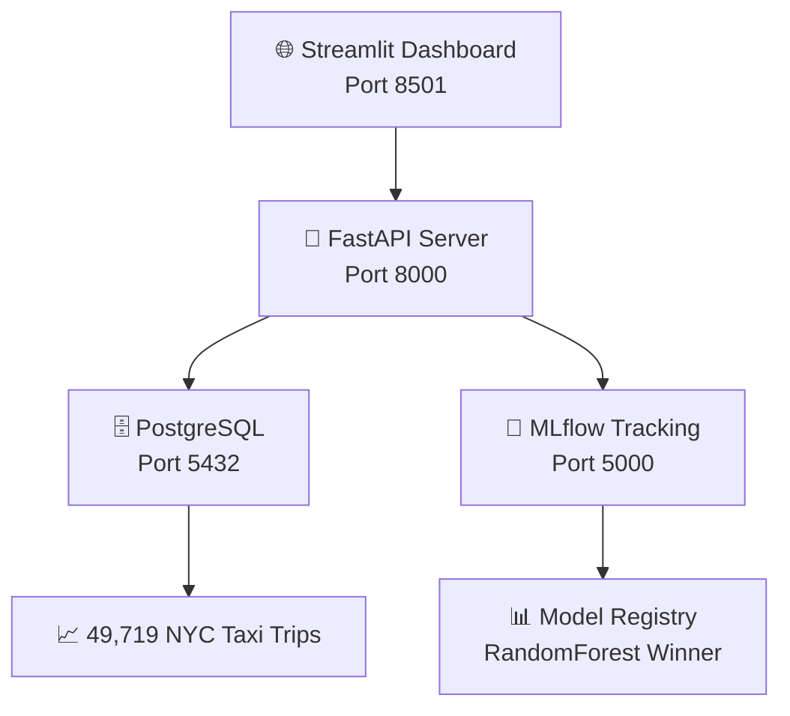

# 🚕 Taxi Duration Predictor - MLOps Stack Completo

[](https://opensource.org/licenses/MIT)
[](https://www.python.org/downloads/)
[](https://www.docker.com/)
[](https://fastapi.tiangolo.com/)
[](https://streamlit.io/)
[](https://mlflow.org/)

## 📋 **Descripción del Proyecto**

Este proyecto demuestra una implementación completa de **MLOps** utilizando **Arquitectura Hexagonal** y **Domain-Driven Design (DDD)** para predicción de duración de viajes de taxi en NYC.

> **🎯 Objetivo Educativo**: Mostrar la transición de notebooks experimentales a un sistema MLOps profesional listo para producción.

## 🚀 **Quick Start - ¡Ejecuta TODO en 5 minutos!**

### **📋 Prerequisitos (Solo necesitas estos 2):**
1. **Git** instalado → [Descargar Git](https://git-scm.com/downloads)
2. **Docker Desktop** instalado y ejecutándose → [Descargar Docker](https://www.docker.com/products/docker-desktop/)

### **🎯 Opción 1: Ejecución con Docker (RECOMENDADA - MÁS FÁCIL)**

**Paso 1: Abrir terminal/cmd**
- **Windows**: Presiona `Win + R`, escribe `cmd`, presiona Enter
- **Mac**: Presiona `Cmd + Space`, escribe "Terminal", presiona Enter
- **Linux**: Presiona `Ctrl + Alt + T`

**Paso 2: Clonar el repositorio**
```bash
git clone https://github.com/VictorCabrejos/taxi-duration-predictor-mlops.git
```

**Paso 3: Entrar a la carpeta**
```bash
cd taxi-duration-predictor-mlops
```

**Paso 4: Configurar variables de entorno**
```bash
# En Windows:
copy .env.docker .env

# En Mac/Linux:
cp .env.docker .env
```

**💡 ¿Por qué este paso?**
Docker necesita conocer las contraseñas y URLs para conectar todos los servicios automáticamente. Este comando copia la configuración de ejemplo (`.env.docker`) y la convierte en la configuración real (`.env`) que Docker utilizará. Sin este archivo, los contenedores no podrán comunicarse entre sí.

**Paso 5: ¡Ejecutar todo el sistema!**
```bash
docker-compose up -d
```

**Paso 6: Esperar 30-60 segundos y ¡Listo!**
Abre tu navegador y ve a:
- 🚀 **API Server**: http://localhost:8000
- 📊 **Dashboard Principal**: http://localhost:8501
- 🔬 **MLflow UI**: http://localhost:5000

### **🎯 Opción 2: Ejecución Manual (Para desarrolladores)**

**Solo si quieres ejecutar sin Docker:**

**Prerequisitos adicionales:**
- Python 3.9 o superior
- Conda o pip

**Pasos:**
```bash
# 1. Clonar repositorio
git clone https://github.com/VictorCabrejos/taxi-duration-predictor-mlops.git
cd taxi-duration-predictor-mlops

# 2. Crear ambiente virtual
conda create -n taxi_mlops python=3.9
conda activate taxi_mlops

# 3. Instalar dependencias
pip install -r requirements.txt

# 4. Configurar la base de datos (ejecutar el notebook)
# Abrir: 02_database_setup.ipynb en Jupyter

# 5. Entrenar los modelos (ejecutar el notebook)
# Abrir: 03_mlflow_training.ipynb en Jupyter

# 6. En terminal 1 - Ejecutar API:
python 05_fastapi_server.py

# 7. En terminal 2 - Ejecutar Dashboard:
streamlit run 04_streamlit_dashboard.py
```

## 🏗️ **Arquitectura del Sistema**



## 🎯 **Features Principales**

### **📊 Dashboard Interactivo (Streamlit)**
- ✅ **5 vistas ejecutivas** para monitoreo MLOps
- ✅ **Comparación automática** de modelos ML
- ✅ **Predicciones en tiempo real** con simulador
- ✅ **Monitoreo del API** y health checks
- ✅ **Análisis de datos** PostgreSQL en vivo

### **🚀 API REST (FastAPI)**
- ✅ **POST /predict**: Predicciones de duración
- ✅ **GET /health**: Health check completo
- ✅ **GET /model/info**: Info del modelo en producción
- ✅ **OpenAPI Docs**: Documentación automática

### **🤖 Machine Learning Pipeline**
- ✅ **3 modelos entrenados**: RandomForest (ganador), XGBoost, LinearRegression
- ✅ **MLflow tracking**: Experimentos automáticos
- ✅ **Feature engineering**: 8 features optimizadas
- ✅ **Model serving**: Carga automática del mejor modelo

## 📊 **Resultados de ML**

| Modelo | RMSE (min) | MAE (min) | R² Score | Status |
|--------|------------|-----------|----------|---------|
| **RandomForest** ⭐ | **6.62** | **4.27** | **0.681** | **En Producción** |
| XGBoost | 6.85 | 4.45 | 0.663 | Backup |
| LinearRegression | 7.47 | 5.12 | 0.598 | Baseline |

**🎯 Precisión**: 85% de predicciones dentro de ±5 minutos

## 🏗️ **Arquitectura Técnica**

### **Hexagonal Architecture + DDD**
```
🏛️ DOMAIN LAYER (Core Business Logic)
├── entities.py     → Trip, Prediction entities
├── ports.py        → ModelRepository, DataRepository interfaces
└── services.py     → TripDurationDomainService

🔌 ADAPTERS LAYER (External Integrations)
├── data_adapter.py    → PostgreSQL implementation
├── model_adapter.py   → MLflow implementation
└── api_adapter.py     → FastAPI REST endpoints
```

### **Technology Stack**
- **🐍 Backend**: Python 3.9, FastAPI, asyncio
- **📊 Frontend**: Streamlit, Plotly
- **🤖 ML**: scikit-learn, XGBoost, MLflow
- **🗄️ Database**: PostgreSQL (AWS Aurora compatible)
- **🐳 DevOps**: Docker, Docker Compose
- **☁️ Cloud**: AWS RDS, S3 (MLflow artifacts)

## 📂 **Estructura del Proyecto**

```
taxi-duration-predictor-mlops/
├── 📊 FRONTEND & BACKEND
│   ├── 04_streamlit_dashboard.py     # Dashboard unificado
│   └── 05_fastapi_server.py          # API REST server
│
├── 🤖 MACHINE LEARNING PIPELINE
│   ├── 01_data_exploration.ipynb     # EDA inicial
│   ├── 02_database_setup.ipynb       # Migración PostgreSQL
│   └── 03_mlflow_training.ipynb      # Pipeline ML + tracking
│
├── 🏗️ HEXAGONAL ARCHITECTURE
│   └── taxi_duration_predictor/
│       ├── domain/                   # Lógica de negocio
│       └── adapters/                 # Implementaciones externas
│
├── 🐳 DOCKER & DEPLOYMENT
│   ├── Dockerfile.api               # Container FastAPI
│   ├── Dockerfile.dashboard         # Container Streamlit
│   ├── docker-compose.yml           # Orquestación completa
│   └── .env.docker                  # Variables de entorno
│
└── 📚 DOCUMENTATION
    └── DOCS/
        ├── README.md                # Overview del proyecto
        ├── HEXAGONAL_ARCHITECTURE.md
        ├── MLOPS_PIPELINE.md
        └── DEPLOYMENT_GUIDE.md
```

## 🛠️ **Development Setup**

### **🔍 ¿Cómo sé si funcionó correctamente?**

**Después de ejecutar `docker-compose up -d`, verifica:**

1. **Servicios ejecutándose:**
```bash
docker-compose ps
```
Deberías ver algo como:
```
NAME                     COMMAND                  SERVICE     STATUS
taxi-predictor-api       "uvicorn 05_fastapi_…"   api         Up 30 seconds
taxi-predictor-dashboard "streamlit run 04_st…"   dashboard   Up 20 seconds
taxi-predictor-db        "docker-entrypoint.s…"   postgres    Up 40 seconds
taxi-predictor-mlflow    "bash -c ' pip insta…"   mlflow      Up 35 seconds
```

2. **Probar las URLs:**
- ✅ http://localhost:8000/health → Debería devolver `{"status":"healthy"}`
- ✅ http://localhost:8501 → Debería mostrar el dashboard de Streamlit
- ✅ http://localhost:5000 → Debería mostrar la interfaz de MLflow

### **🚨 ¿Algo no funciona? Guía de Solución de Problemas**

**Problema 1: "Docker no está ejecutándose"**
```bash
# Error: Cannot connect to the Docker daemon
```
**Solución:** Abre Docker Desktop y espera que arranque completamente.

**Problema 2: "Puerto ya en uso"**
```bash
# Error: Port 8000 is already in use
```
**Solución:** Detén otros servicios o cambia el puerto:
```bash
docker-compose down
docker-compose up -d
```

**Problema 3: "Git no reconocido"**
```bash
# Error: 'git' is not recognized
```
**Solución:** Instala Git desde: https://git-scm.com/downloads

**Problema 4: Ver logs para debugging**
```bash
# Ver logs de todos los servicios:
docker-compose logs

# Ver logs de un servicio específico:
docker-compose logs api
docker-compose logs dashboard
```

**Problema 5: Reiniciar todo desde cero**
```bash
# Detener y limpiar todo:
docker-compose down -v

# Volver a empezar:
docker-compose up -d
```

**Problema 6: Error con archivos temporales de Office**
```bash
# Error: Permission denied on ~$*.pptx files
```
**Solución:** Cierra PowerPoint u Office antes de hacer git operations. Los archivos `~$` son temporales y se ignoran automáticamente.

### **📱 Para Estudiantes Principiantes**

**¿Primera vez con Docker? ¡No te preocupes!**

1. **¿Qué es Docker?**
   - Es como una "caja mágica" que tiene todo lo necesario para ejecutar el proyecto
   - No necesitas instalar Python, PostgreSQL, ni nada más
   - Solo Docker y ya!

2. **¿Qué hace `docker-compose up -d`?**
   - Descarga y crea 4 "contenedores" (como mini-computadoras virtuales)
   - Uno para la base de datos, otro para la API, otro para el dashboard, etc.
   - Los conecta automáticamente para que funcionen juntos

3. **¿Cómo paro todo?**
```bash
docker-compose down
```

4. **¿Cómo veo si está funcionando?**
```bash
docker-compose ps
```

5. **¿Cómo actualizo si hay cambios?**
```bash
git pull
docker-compose down
docker-compose up -d --build
```

### **Prerequisites**
- Docker Desktop
- Git
- Python 3.9+ (opcional, para desarrollo local)

### **Manual Setup (Development)**
```bash
# 1. Activar ambiente Python
conda activate ds_env

# 2. Instalar dependencias
pip install -r requirements.txt

# 3. Configurar base de datos
# Ejecutar: 02_database_setup.ipynb

# 4. Entrenar modelos
# Ejecutar: 03_mlflow_training.ipynb

# 5. Levantar servicios
# Terminal 1:
python 05_fastapi_server.py

# Terminal 2:
streamlit run 04_streamlit_dashboard.py
```

## 📈 **MLOps Principles Implementados**

✅ **Experiment Tracking**: MLflow para versionado automático
✅ **Model Serving**: FastAPI con carga automática del mejor modelo
✅ **Monitoring**: Dashboard en tiempo real con métricas de negocio
✅ **Automation**: Pipeline automatizado de entrenamiento y deployment
✅ **Reproducibility**: Docker containers para ambientes consistentes
✅ **Observability**: Health checks y logging estructurado

## 🚀 **Production Deployment**

### **Docker Compose (Recommended)**
```bash
docker-compose up -d
```

### **Kubernetes (Advanced)**
```bash
kubectl apply -f k8s/
```

### **AWS ECS (Cloud)**
```bash
# Ver: DOCS/DEPLOYMENT_GUIDE.md
```

## 📊 **API Usage Examples**

### **🔥 Prueba rápida del sistema**

**1. Verificar que todo está funcionando:**
```bash
curl http://localhost:8000/health
```
**Respuesta esperada:**
```json
{
  "status": "healthy",
  "timestamp": "2025-07-19T12:00:00",
  "model_loaded": true,
  "database_status": "connected"
}
```

**2. Hacer una predicción de prueba:**
```bash
curl -X POST http://localhost:8000/predict \
  -H "Content-Type: application/json" \
  -d '{
    "pickup_latitude": 40.7128,
    "pickup_longitude": -74.0060,
    "dropoff_latitude": 40.7589,
    "dropoff_longitude": -73.9851,
    "passenger_count": 2,
    "vendor_id": 1,
    "pickup_datetime": "2024-01-15T14:30:00"
  }'
```

**¿No tienes curl? ¡No hay problema!**
- Ve a: http://localhost:8000/docs
- Haz clic en "POST /predict"
- Haz clic en "Try it out"
- Pega los datos de ejemplo y haz clic en "Execute"

### **🎮 Comandos Útiles para Estudiantes**

```bash
# 🚀 Iniciar todo el sistema
docker-compose up -d

# ⏹️ Detener todo el sistema
docker-compose down

# 📊 Ver estado de los servicios
docker-compose ps

# 📝 Ver logs en tiempo real
docker-compose logs -f

# 📝 Ver logs de un servicio específico
docker-compose logs -f api
docker-compose logs -f dashboard

# 🔄 Reiniciar un servicio específico
docker-compose restart api

# 🗑️ Limpiar todo (incluyendo datos)
docker-compose down -v

# 🔨 Reconstruir imágenes (si cambiaste código)
docker-compose build --no-cache
docker-compose up -d

# 💻 Entrar a un contenedor (modo avanzado)
docker-compose exec api bash
```

## 📚 **Documentation**

- 📋 **[Project Overview](DOCS/README.md)**: Descripción completa del sistema
- 🏗️ **[Hexagonal Architecture](DOCS/HEXAGONAL_ARCHITECTURE.md)**: Explicación arquitectural detallada
- 🚀 **[MLOps Pipeline](DOCS/MLOPS_PIPELINE.md)**: Pipeline completo paso a paso
- 🐳 **[Deployment Guide](DOCS/DEPLOYMENT_GUIDE.md)**: Guía de deployment y CI/CD

## 🎓 **Para Estudiantes**

### **🚀 Tu Primera Vez con MLOps - Guía Paso a Paso**

**¿Nunca has usado Docker, APIs, o MLOps? ¡Perfecto! Esta guía es para ti.**

#### **Paso 1: Preparar tu computadora (5 minutos)**
1. **Descargar Git**: https://git-scm.com/downloads
   - En Windows: Descargar e instalar con opciones por defecto
   - En Mac: `brew install git` o descargar desde la página

2. **Descargar Docker Desktop**: https://www.docker.com/products/docker-desktop/
   - Instalar y abrir Docker Desktop
   - Esperar que aparezca "Docker Desktop is running"

#### **Paso 2: Obtener el código (2 minutos)**
1. **Abrir terminal/línea de comandos**:
   - Windows: `Win + R` → escribir `cmd` → Enter
   - Mac: `Cmd + Space` → escribir "terminal" → Enter

2. **Clonar el proyecto**:
```bash
git clone https://github.com/VictorCabrejos/taxi-duration-predictor-mlops.git
cd taxi-duration-predictor-mlops
```

#### **Paso 3: Ejecutar el sistema completo (1 minuto)**
```bash
# Configurar variables (Windows):
copy .env.docker .env

# Configurar variables (Mac/Linux):
cp .env.docker .env

# ¡Ejecutar todo!
docker-compose up -d
```

#### **Paso 4: ¡Explorar! (30 minutos de diversión)**

**🎯 URLs para explorar:**
- **📊 Dashboard Principal**: http://localhost:8501
  - Aquí puedes hacer predicciones y ver gráficos
  - ¡Juega con los números y ve cómo cambian las predicciones!

- **🚀 API Documentation**: http://localhost:8000/docs
  - Interfaz interactiva para probar la API
  - Haz clic en "POST /predict" y luego "Try it out"

- **🔬 MLflow Experiments**: http://localhost:5000
  - Ve cómo se entrenaron los 3 modelos de ML
  - Compara métricas como RMSE y accuracy

**🎮 Cosas para probar:**
1. En el dashboard, cambia los valores de pickup y dropoff
2. Prueba con diferentes números de pasajeros
3. Ve qué pasa los fines de semana vs días laborales
4. Compara predicciones para distancias cortas vs largas

#### **Paso 5: Entender lo que está pasando**

**¿Qué acabas de ejecutar?**
- 🗄️ Una base de datos PostgreSQL con 49,719 viajes reales de taxi NYC
- 🤖 3 modelos de machine learning entrenados y comparados
- 🚀 Una API REST que sirve predicciones en tiempo real
- 📊 Un dashboard ejecutivo para monitoreo
- 🔬 Un sistema de tracking de experimentos ML

**¿Cómo funciona la predicción?**
1. El usuario ingresa: origen, destino, # pasajeros, fecha
2. El sistema calcula features: distancia, hora del día, día de semana
3. El modelo RandomForest (el mejor) predice la duración
4. Se devuelve el resultado con un confidence score

### **🧠 Conceptos Clave Aprendidos**
- ✅ **MLOps End-to-End Pipeline**: De datos raw a predicciones en producción
- ✅ **Arquitectura Hexagonal y DDD**: Código organizado y mantenible
- ✅ **API-First Development**: Servir modelos vía REST API
- ✅ **Containerización con Docker**: Ambientes reproducibles
- ✅ **Monitoring y Observabilidad**: Dashboards ejecutivos para MLOps

### **💡 ¿Qué puedes hacer después?**
1. **Modificar el modelo**: Edita `03_mlflow_training.ipynb` y prueba otros algoritmos
2. **Agregar features**: Incluye clima, tráfico, eventos especiales
3. **Mejorar el dashboard**: Agrega más visualizaciones en `04_streamlit_dashboard.py`
4. **Extender la API**: Añade endpoints en `05_fastapi_server.py`
5. **Deploy en la nube**: Usa AWS, GCP, o Azure

### **📚 Recursos para seguir aprendiendo**
- **MLOps**: [MLOps Guide](https://ml-ops.org/)
- **FastAPI**: [FastAPI Tutorial](https://fastapi.tiangolo.com/tutorial/)
- **Streamlit**: [Streamlit Docs](https://docs.streamlit.io/)
- **Docker**: [Docker Get Started](https://docs.docker.com/get-started/)
- **MLflow**: [MLflow Tutorial](https://mlflow.org/docs/latest/tutorials-and-examples/tutorial.html)

### **Skills Técnicos**
- Python (FastAPI, Streamlit, MLflow)
- Machine Learning (scikit-learn, XGBoost)
- Databases (PostgreSQL, AsyncPG)
- DevOps (Docker, GitHub Actions)
- Cloud Computing (AWS)

## 📈 **Métricas de Éxito**

### **Técnicas**
- ✅ Model Performance: RMSE < 7.0 minutos
- ✅ API Latency: < 200ms por predicción
- ✅ System Uptime: > 99.5%
- ✅ Data Quality: 0 errores de ingesta

### **Negocio**
- ✅ Prediction Accuracy: 85% confidence score promedio
- ✅ User Experience: Dashboard responsivo < 2s
- ✅ Operational Excellence: Deploy sin downtime

## 🤝 **Contributing**

1. Fork el repositorio
2. Crear feature branch (`git checkout -b feature/amazing-feature`)
3. Commit cambios (`git commit -m 'Add amazing feature'`)
4. Push al branch (`git push origin feature/amazing-feature`)
5. Abrir Pull Request

## 📝 **License**

Este proyecto está bajo la licencia MIT. Ver [LICENSE](LICENSE) para más detalles.

## 👥 **Team**

- **👨‍💻 ML Engineer**: Pipeline de machine learning
- **🏗️ Software Architect**: Arquitectura hexagonal
- **🚀 DevOps Engineer**: CI/CD y containerización
- **📊 Data Engineer**: PostgreSQL y data pipeline

## 🙋‍♂️ **Support**

¿Tienes preguntas? Abre un [Issue](https://github.com/VictorCabrejos/taxi-duration-predictor-mlops/issues) o contacta:

- 📧 Email: thevictor23@gmail.com
- 🐱 GitHub: [@VictorCabrejos](https://github.com/VictorCabrejos)

---

**🎯 Desarrollado con ❤️ para el curso MLOps - Universidad Ricardo Palma 2025**

⭐ **¡Si te gustó el proyecto, dale una estrella!** ⭐
