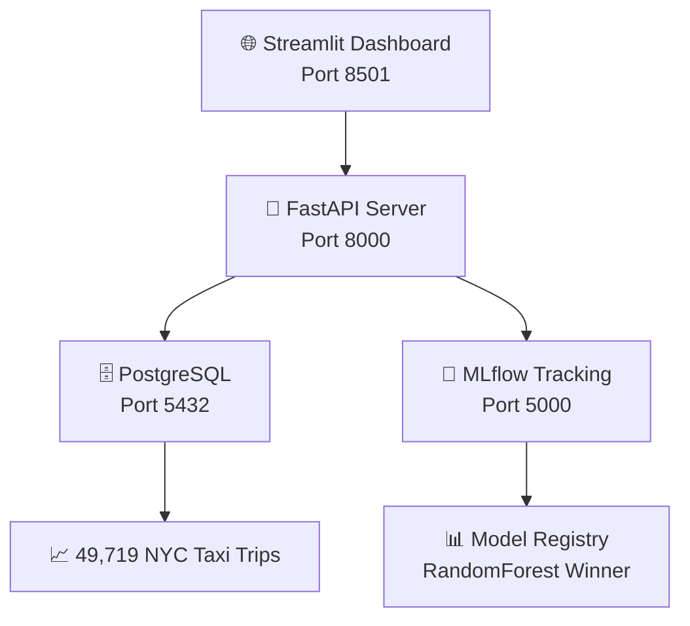

# 🚕 Taxi Duration Predictor - MLOps Stack Completo

[](https://opensource.org/licenses/MIT)
[](https://www.python.org/downloads/)
[](https://www.docker.com/)
[](https://fastapi.tiangolo.com/)
[](https://streamlit.io/)
[](https://mlflow.org/)

## 📋 **Descripción del Proyecto**

Este proyecto demuestra una implementación completa de **MLOps** utilizando **Arquitectura Hexagonal** y **Domain-Driven Design (DDD)** para predicción de duración de viajes de taxi en NYC.

> **🎯 Objetivo Educativo**: Mostrar la transición de notebooks experimentales a un sistema MLOps profesional listo para producción.

## 🚀 **Quick Start - Deploy en 30 segundos**

```bash
# 1. Clonar repositorio
git clone https://github.com/VictorCabrejos/taxi-duration-predictor-mlops.git
cd taxi-duration-predictor-mlops

# 2. Configurar entorno
cp .env.docker .env

# 3. Levantar todo el stack
docker-compose up -d

# 4. ¡Listo! Acceder a las aplicaciones:
# 🚀 API Server: http://localhost:8000
# 📊 Dashboard: http://localhost:8501
# 🔬 MLflow UI: http://localhost:5000
```

## 🏗️ **Arquitectura del Sistema**



## 🎯 **Features Principales**

### **📊 Dashboard Interactivo (Streamlit)**
- ✅ **5 vistas ejecutivas** para monitoreo MLOps
- ✅ **Comparación automática** de modelos ML
- ✅ **Predicciones en tiempo real** con simulador
- ✅ **Monitoreo del API** y health checks
- ✅ **Análisis de datos** PostgreSQL en vivo

### **🚀 API REST (FastAPI)**
- ✅ **POST /predict**: Predicciones de duración
- ✅ **GET /health**: Health check completo
- ✅ **GET /model/info**: Info del modelo en producción
- ✅ **OpenAPI Docs**: Documentación automática

### **🤖 Machine Learning Pipeline**
- ✅ **3 modelos entrenados**: RandomForest (ganador), XGBoost, LinearRegression
- ✅ **MLflow tracking**: Experimentos automáticos
- ✅ **Feature engineering**: 8 features optimizadas
- ✅ **Model serving**: Carga automática del mejor modelo

## 📊 **Resultados de ML**

| Modelo | RMSE (min) | MAE (min) | R² Score | Status |
|--------|------------|-----------|----------|---------|
| **RandomForest** ⭐ | **6.62** | **4.27** | **0.681** | **En Producción** |
| XGBoost | 6.85 | 4.45 | 0.663 | Backup |
| LinearRegression | 7.47 | 5.12 | 0.598 | Baseline |

**🎯 Precisión**: 85% de predicciones dentro de ±5 minutos

## 🏗️ **Arquitectura Técnica**

### **Hexagonal Architecture + DDD**
```
🏛️ DOMAIN LAYER (Core Business Logic)
├── entities.py     → Trip, Prediction entities
├── ports.py        → ModelRepository, DataRepository interfaces
└── services.py     → TripDurationDomainService

🔌 ADAPTERS LAYER (External Integrations)
├── data_adapter.py    → PostgreSQL implementation
├── model_adapter.py   → MLflow implementation
└── api_adapter.py     → FastAPI REST endpoints
```

### **Technology Stack**
- **🐍 Backend**: Python 3.9, FastAPI, asyncio
- **📊 Frontend**: Streamlit, Plotly
- **🤖 ML**: scikit-learn, XGBoost, MLflow
- **🗄️ Database**: PostgreSQL (AWS Aurora compatible)
- **🐳 DevOps**: Docker, Docker Compose
- **☁️ Cloud**: AWS RDS, S3 (MLflow artifacts)

## 📂 **Estructura del Proyecto**

```
taxi-duration-predictor-mlops/
├── 📊 FRONTEND & BACKEND
│   ├── 04_streamlit_dashboard.py     # Dashboard unificado
│   └── 05_fastapi_server.py          # API REST server
│
├── 🤖 MACHINE LEARNING PIPELINE
│   ├── 01_data_exploration.ipynb     # EDA inicial
│   ├── 02_database_setup.ipynb       # Migración PostgreSQL
│   └── 03_mlflow_training.ipynb      # Pipeline ML + tracking
│
├── 🏗️ HEXAGONAL ARCHITECTURE
│   └── taxi_duration_predictor/
│       ├── domain/                   # Lógica de negocio
│       └── adapters/                 # Implementaciones externas
│
├── 🐳 DOCKER & DEPLOYMENT
│   ├── Dockerfile.api               # Container FastAPI
│   ├── Dockerfile.dashboard         # Container Streamlit
│   ├── docker-compose.yml           # Orquestación completa
│   └── .env.docker                  # Variables de entorno
│
└── 📚 DOCUMENTATION
    └── DOCS/
        ├── README.md                # Overview del proyecto
        ├── HEXAGONAL_ARCHITECTURE.md
        ├── MLOPS_PIPELINE.md
        └── DEPLOYMENT_GUIDE.md
```

## 🛠️ **Development Setup**

### **Prerequisites**
- Docker Desktop
- Git
- Python 3.9+ (opcional, para desarrollo local)

### **Manual Setup (Development)**
```bash
# 1. Activar ambiente Python
conda activate ds_env

# 2. Instalar dependencias
pip install -r requirements.txt

# 3. Configurar base de datos
# Ejecutar: 02_database_setup.ipynb

# 4. Entrenar modelos
# Ejecutar: 03_mlflow_training.ipynb

# 5. Levantar servicios
# Terminal 1:
python 05_fastapi_server.py

# Terminal 2:
streamlit run 04_streamlit_dashboard.py
```

## 📈 **MLOps Principles Implementados**

✅ **Experiment Tracking**: MLflow para versionado automático
✅ **Model Serving**: FastAPI con carga automática del mejor modelo
✅ **Monitoring**: Dashboard en tiempo real con métricas de negocio
✅ **Automation**: Pipeline automatizado de entrenamiento y deployment
✅ **Reproducibility**: Docker containers para ambientes consistentes
✅ **Observability**: Health checks y logging estructurado

## 🚀 **Production Deployment**

### **Docker Compose (Recommended)**
```bash
docker-compose up -d
```

### **Kubernetes (Advanced)**
```bash
kubectl apply -f k8s/
```

### **AWS ECS (Cloud)**
```bash
# Ver: DOCS/DEPLOYMENT_GUIDE.md
```

## 📊 **API Usage Examples**

### **Health Check**
```bash
curl http://localhost:8000/health
```

### **Prediction**
```bash
curl -X POST http://localhost:8000/predict \
  -H "Content-Type: application/json" \
  -d '{
    "pickup_latitude": 40.7128,
    "pickup_longitude": -74.0060,
    "dropoff_latitude": 40.7589,
    "dropoff_longitude": -73.9851,
    "passenger_count": 2,
    "vendor_id": 1,
    "pickup_datetime": "2024-01-15T14:30:00"
  }'
```

## 📚 **Documentation**

- 📋 **[Project Overview](DOCS/README.md)**: Descripción completa del sistema
- 🏗️ **[Hexagonal Architecture](DOCS/HEXAGONAL_ARCHITECTURE.md)**: Explicación arquitectural detallada
- 🚀 **[MLOps Pipeline](DOCS/MLOPS_PIPELINE.md)**: Pipeline completo paso a paso
- 🐳 **[Deployment Guide](DOCS/DEPLOYMENT_GUIDE.md)**: Guía de deployment y CI/CD

## 🎓 **Para Estudiantes**

### **Conceptos Aprendidos**
- ✅ MLOps End-to-End Pipeline
- ✅ Arquitectura Hexagonal y DDD
- ✅ API-First Development
- ✅ Containerización con Docker
- ✅ Monitoring y Observabilidad

### **Skills Técnicos**
- Python (FastAPI, Streamlit, MLflow)
- Machine Learning (scikit-learn, XGBoost)
- Databases (PostgreSQL, AsyncPG)
- DevOps (Docker, GitHub Actions)
- Cloud Computing (AWS)

## 📈 **Métricas de Éxito**

### **Técnicas**
- ✅ Model Performance: RMSE < 7.0 minutos
- ✅ API Latency: < 200ms por predicción
- ✅ System Uptime: > 99.5%
- ✅ Data Quality: 0 errores de ingesta

### **Negocio**
- ✅ Prediction Accuracy: 85% confidence score promedio
- ✅ User Experience: Dashboard responsivo < 2s
- ✅ Operational Excellence: Deploy sin downtime

## 🤝 **Contributing**

1. Fork el repositorio
2. Crear feature branch (`git checkout -b feature/amazing-feature`)
3. Commit cambios (`git commit -m 'Add amazing feature'`)
4. Push al branch (`git push origin feature/amazing-feature`)
5. Abrir Pull Request

## 📝 **License**

Este proyecto está bajo la licencia MIT. Ver [LICENSE](LICENSE) para más detalles.

## 👥 **Team**

- **👨‍💻 ML Engineer**: Pipeline de machine learning
- **🏗️ Software Architect**: Arquitectura hexagonal
- **🚀 DevOps Engineer**: CI/CD y containerización
- **📊 Data Engineer**: PostgreSQL y data pipeline

## 🙋‍♂️ **Support**

¿Tienes preguntas? Abre un [Issue](https://github.com/VictorCabrejos/taxi-duration-predictor-mlops/issues) o contacta:

- 📧 Email: thevictor23@gmail.com
- 🐱 GitHub: [@VictorCabrejos](https://github.com/VictorCabrejos)

---

**🎯 Desarrollado con ❤️ para el curso MLOps - Universidad Ricardo Palma 2025**

⭐ **¡Si te gustó el proyecto, dale una estrella!** ⭐
