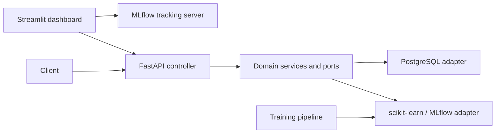

# Taxi Duration Predictor MLOps

An educational reference implementation that shows how a taxi-duration model can move from domain logic to a testable API, experiment tracking, a dashboard, and containerized services.

## Why it exists

The repository demonstrates the engineering boundaries around a machine-learning model: domain entities and ports, model and database adapters, a training/prediction pipeline, FastAPI serving, MLflow tracking, and Streamlit observability. It is a portfolio and teaching system, not a hosted production service.

## Architecture


```mermaid
flowchart LR
    Client --> API[FastAPI controller]
    API --> Domain[Domain services and ports]
    Domain --> Model[scikit-learn / MLflow adapter]
    Domain --> Data[PostgreSQL adapter]
    Training[Training pipeline] --> Model
    Dashboard[Streamlit dashboard] --> API
    Dashboard --> Tracking[MLflow tracking server]
```

See [DOCS/architecture.md](DOCS/architecture.md) for responsibilities, runtime boundaries, and verified limitations.

## Quick start

Python 3.10 or newer is required.

```bash
python -m venv .venv
# Windows: .venv\Scripts\activate
# macOS/Linux: source .venv/bin/activate
python -m pip install --upgrade pip
python -m pip install -e ".[api,mlops,dev]"
python -m pytest
uvicorn taxi_duration_predictor.api.main:app --reload
```

The generated OpenAPI documentation is then available at `http://localhost:8000/docs`; the service-local health endpoint is `GET /health`. Prediction and model-information endpoints require an operator-provided, usable model and MLflow setup.

## Docker Compose

Docker is useful when the API, dashboard, PostgreSQL, and MLflow services need to be demonstrated together.

```bash
cd deployment
cp .env.docker.example .env.docker
# Replace every CHANGE_ME_LOCAL_ONLY value.
docker compose --env-file .env.docker config
docker compose --env-file .env.docker up --build
```

No functional credential is committed. Compose refuses to start without `POSTGRES_PASSWORD`. The local `.env.docker` file is ignored.

The Compose file is a local demonstration topology, not a cloud deployment. It starts PostgreSQL, MLflow, the API, and the dashboard; the API and dashboard images use the same application dependency declarations as local installation.

## Testing and quality

```bash
python -m pytest
python -m pytest tests/api/test_contract.py
python -m ruff check --select F taxi_duration_predictor tests/unit tests/conftest.py
python -m compileall -q taxi_duration_predictor
```

The default unit suite covers deterministic domain rules and secrets-safe configuration. The API contract test checks OpenAPI generation and the service-local health route and requires the `api`, `mlops`, and `dev` extras. The scripts named `system_validation*.py` are optional live-service probes; they are not counted as unit tests and require running services.

## CI and dependency security

GitHub Actions tests the supported minimum (Python 3.10) and the primary container version (Python 3.11). It runs unit coverage, fatal lint and syntax checks, builds a wheel, exercises the API contract, audits the resolved Python environment with `pip-audit`, scans the current repository snapshot for secrets, validates Compose, builds both application images, and checks their local health endpoints.

The Docker job is the release-candidate runtime gate when a local Docker engine is unavailable. A branch must not be merged while that job is failing or incomplete.

## Dependency management

- **Authoritative source:** `pyproject.toml`, including the `api`, `mlops`, `dev`, and `audit` extras.
- **Generated or derived files:** none are committed. The former hand-maintained `requirements.txt` was removed to prevent dependency drift.
- **Update procedure:** edit and review the bounded ranges in `pyproject.toml`; install `.[api,mlops,dev,audit]` in a clean environment; freeze the resolved non-editable packages to a temporary audit file; run `python -m pip_audit --strict --requirement <audit-file> --progress-spinner off`; then rerun tests, the API contract, and both Docker builds. Do not commit the temporary audit file.

Historical teaching notes under `DOCS/` and `educational_resources/` may show earlier dependency or deployment examples. The commands in this README and `pyproject.toml` define the current supported workflow.

## Data, model, and API requirements

- No NYC trip dataset, fitted production model, or MLflow run is bundled in the tracked tree.
- The bootstrap training path in `taxi_duration_predictor/pipeline/train.py` uses synthetic data and labels its MLflow runs accordingly.
- PostgreSQL access requires `DATABASE_URL`; there is no embedded database password.
- Model and data provenance must be recorded by the operator for any non-synthetic run.
- The sample coordinates in tests are synthetic examples and contain no person-level records.
- The Streamlit dashboard reads `DATABASE_URL` and `MLFLOW_TRACKING_URI` from its runtime environment; it reports unavailable backing services rather than supplying embedded credentials.

## Repository map

- `taxi_duration_predictor/domain/`: entities, ports, and orchestration logic.
- `taxi_duration_predictor/adapters/`: PostgreSQL, scikit-learn, and MLflow integrations.
- `taxi_duration_predictor/pipeline/`: training and prediction workflows.
- `taxi_duration_predictor/api/`: FastAPI routes and application factory.
- `observability/dashboards/`: Streamlit dashboard.
- `deployment/`: Dockerfiles, Compose definitions, and placeholder-only configuration.
- `educational_resources/`: notebooks and supporting teaching material; review notebook outputs before reuse.

## Limitations

- This is a reference implementation, not an SLA-backed deployment.
- The default bootstrap is synthetic and cannot substantiate real-world accuracy claims.
- External integration tests for PostgreSQL, MLflow, the dashboard, and the full Compose stack are not part of the fast unit-test gate.
- CORS and deployment hardening must be configured for the intended environment.
- Dependency ranges are bounded compatibility declarations, not a byte-for-byte reproducible lock file.
- The dashboard demonstrates application-level status and experiment views; it is not an alerting, metrics-retention, or SLA-monitoring platform.
- No cloud deployment, image publication, or automated model promotion is implemented.

## Educational value

The project supports a guided comparison between pure domain rules and infrastructure adapters, then extends that lesson to experiment tracking, model serving, observability, and container orchestration. It is suitable as a production-oriented MLOps case study or a workshop spine when the instructor supplies an approved dataset and clearly distinguishes synthetic metrics from measured results.

## License

Licensed under the [MIT License](LICENSE).
