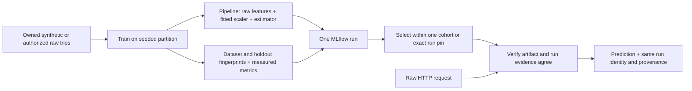

# Taxi Duration Predictor MLOps

A small MLOps reference that makes a prediction attributable: raw trips → one fitted preprocessing/model artifact → a comparable evaluation cohort → an exact MLflow run → an HTTP response carrying that run's metrics and data provenance.

The runnable example uses owned synthetic trips. It demonstrates lifecycle correctness, not real NYC accuracy or a production service.

## Reproduce the lifecycle

Python 3.10+:

```bash
python -m venv .venv
# Windows: .venv\Scripts\activate
# macOS/Linux: source .venv/bin/activate
python -m pip install -e ".[api,mlops,dev]"
python -m pytest tests/unit tests/api tests/integration
mkdir -p data
python -m taxi_duration_predictor.pipeline.train --bootstrap
uvicorn taxi_duration_predictor.api.main:app --host 127.0.0.1 --port 8000
```

On PowerShell, replace `mkdir -p data` with `New-Item -ItemType Directory -Force data`. Bootstrap prints the exact `best_run_id`, `cohort_id`, measured validation metrics and synthetic provenance. Its raw-trip generator, random seed, target formula and MIT ownership are in `pipeline/train.py`.

The compatibility launcher requires an explicit operation: `python main.py bootstrap`
delegates to that synthetic training module; `python main.py api` serves only the API
on loopback. It never auto-trains, creates dummy models, or claims model readiness.
Failed child commands retain their exit code. Bare `python main.py` shows usage.

Optional UI: `streamlit run observability/dashboards/enhanced_dashboard.py`.
Set `API_BASE_URL` if the API is not at `http://127.0.0.1:8000`. This API-only
consumer shows the exact response's model evidence and unavailable confidence;
it does not query another model, rank incompatible runs, or substitute a heuristic
when prediction fails. Previous multi-service launcher/dashboard implementations
remain in Git history, not active runtime paths. The obsolete unified Dockerfile
and simple Compose topology were removed; use `deployment/docker-compose.yml`.

```bash
curl http://127.0.0.1:8000/api/v1/predict/ \
  -H 'Content-Type: application/json' \
  -d '{"pickup_latitude":40.7,"pickup_longitude":-74.0,"dropoff_latitude":40.8,"dropoff_longitude":-73.9,"pickup_datetime":"2026-01-01T08:00:00-05:00"}'
```

The response includes `run_id`, `model_version` (the same ID), `model.artifact_uri`, `model.provenance`, measured RMSE/MAE/R², and the exact features used. Confidence remains `null / NOT_AVAILABLE`; it is not calibrated. `GET /api/v1/health/model` inspects the current selection; each prediction already contains its own immutable selection snapshot, so a later training run cannot relabel an earlier response.

## Selection and provenance rules

Training and serving read the same `MLFLOW_TRACKING_URI` (default `sqlite:///data/mlflow.db`) and `MLFLOW_EXPERIMENT_NAME`. A cohort hashes the ordered canonical raw inputs and targets, holdout rows, source/permission declaration, seed, split fraction, target unit and feature implementation. Only finite metrics from that cohort may compete. Ranking is RMSE ascending, creation time descending, then run ID ascending; the search traverses every page.

- With exactly one eligible cohort, serving selects its best run. Synthetic provenance remains visible.
- With multiple cohorts, serving returns 503 until `TAXI_MODEL_COHORT_ID` or `TAXI_MODEL_RUN_ID` explicitly selects one. A low synthetic RMSE cannot automatically beat an operator-data model.
- With a run pin, inference uses that exact finished run. If both pin and cohort are set, they must agree. Restart the API to change its configuration.
- Legacy or malformed evidence is inspectable with a pinned run, but metrics are `NOT_AVAILABLE` and prediction returns 503. Retrain; the service never upgrades legacy metrics into new evidence.
- Missing, corrupt or incompatible artifacts and failed inference return 503. There is no heuristic success fallback. Invalid requests return 422.

Dataset declarations are operator assertions, not ownership certification. For authorized operator data in PostgreSQL:

```bash
# Supply DATABASE_URL and MLFLOW_TRACKING_URI through your environment.
python -m taxi_duration_predictor.pipeline.train \
  --dataset-id approved-dataset-version \
  --source approved-source-reference \
  --license approved-permission-reference
```

Use public-safe labels: source/permission declarations are returned in the API. No raw dataset is bundled or copied into MLflow. Retain the authorized input separately to reproduce its fingerprint. A holdout measures this declared dataset; it is not a claim of temporal generalization or deployment quality.

## Architecture


```mermaid
flowchart LR
    Raw[Owned synthetic or authorized raw trips] --> Train[Train on seeded partition]
    Train --> Artifact[Pipeline: raw features + fitted scaler + estimator]
    Train --> Evidence[Dataset and holdout fingerprints + measured metrics]
    Artifact --> Run[One MLflow run]
    Evidence --> Run
    Run --> Select[Select within one cohort or exact run pin]
    Select --> Load[Verify artifact and run evidence agree]
    Request[Raw HTTP request] --> Load
    Load --> Response[Prediction + same run identity and provenance]
```

[Architecture and boundaries](DOCS/architecture.md) explains the active runtime, failure semantics and trust limits. Domain services under `domain/services.py` remain teaching examples; the current API uses the prediction pipeline directly.

## Verification

```bash
python scripts/check_no_embedded_operational_credentials.py
python -m pytest tests/unit tests/api tests/integration
python -m ruff check --select F taxi_duration_predictor tests/unit tests/api tests/integration tests/conftest.py
```

The integration suite fits an actual raw-input linear model, saves/reloads it through MLflow SQLite, then sends HTTP requests through FastAPI's real router and environment-configured dependency. It checks numerical parity, features, run identity, persisted provenance and metrics. Other tests try to falsify cohort isolation, paging, deterministic ties, artifact/metadata binding, legacy compatibility, tracking-store isolation, timezone equivalence and failure behavior. Synthetic selection doubles are labeled as such; they are not measured operator-data results.

CI also builds a wheel, audits resolved dependencies, scans secrets, tests Python 3.10/3.11, and builds API/dashboard images. Its Docker lifecycle trains in a separate container through an HTTP MLflow artifact server and predicts through the API with **no shared artifact filesystem**, checking the returned run against the training result. Health checks alone are not the lifecycle gate.

## Local Compose

```bash
cd deployment
cp .env.docker.example .env.docker
# Replace CHANGE_ME_LOCAL_ONLY; this ignored file is local configuration.
docker compose --env-file .env.docker up --build -d
docker compose --env-file .env.docker exec api python -m taxi_duration_predictor.pipeline.train --bootstrap
```

Compose refuses to start without `POSTGRES_PASSWORD`. MLflow serves artifacts over HTTP; other containers do not need its disk. Set the run/cohort variables in the local Compose environment when more than one cohort exists. This is an unauthenticated local demonstration topology; do not expose the tracker or its pickle artifacts to untrusted parties.

## Scope and limitations

- No private/student/client data, production model, cloud deployment or real-world accuracy benchmark is included.
- The two supported learners are LinearRegression and RandomForest. Both use the same versioned raw feature path. Naive timestamps mean NYC wall time; ambiguous/nonexistent DST times require an explicit offset.
- Model files and the tracker are trusted operator-controlled inputs. Python model deserialization is not a sandbox or tamper-proof ledger.
- The feature source fingerprint rejects changed preprocessing implementations. Dependency ranges in `pyproject.toml` are compatibility bounds, not a reproducible lock. MLflow records the artifact's environment; validate upgrades and retrain when incompatible.
- The dashboard and historical documents/notebooks are supplementary teaching views, not the authoritative model-selection or quality gate. The supported commands and claims are those in this README.
- PostgreSQL/live dashboard behavior and deployment hardening are outside the owned synthetic lifecycle regression. The API is a reference service, with no SLA or calibration claim.

Licensed under the [MIT License](LICENSE).
